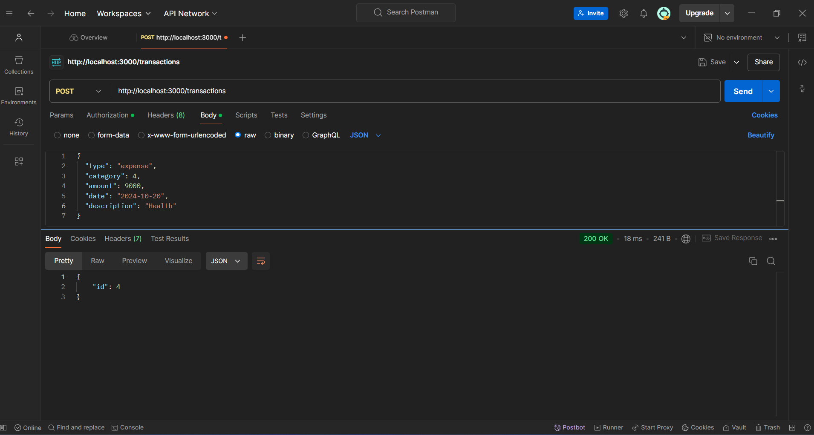
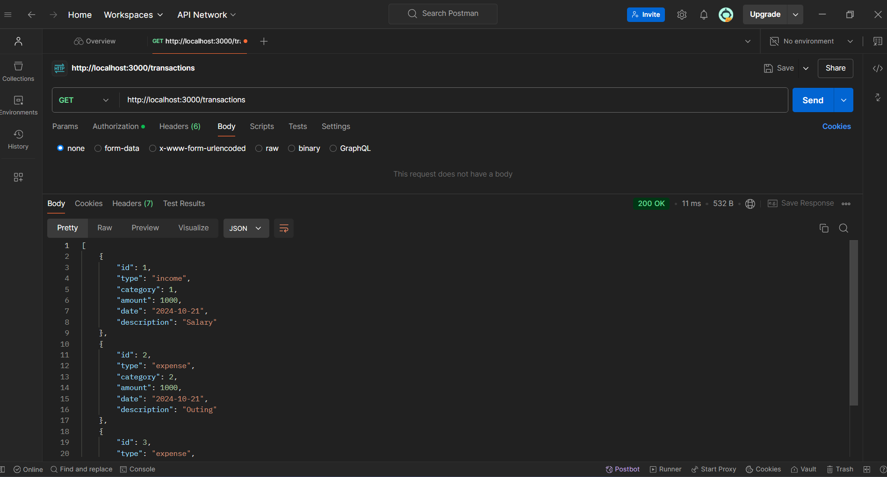
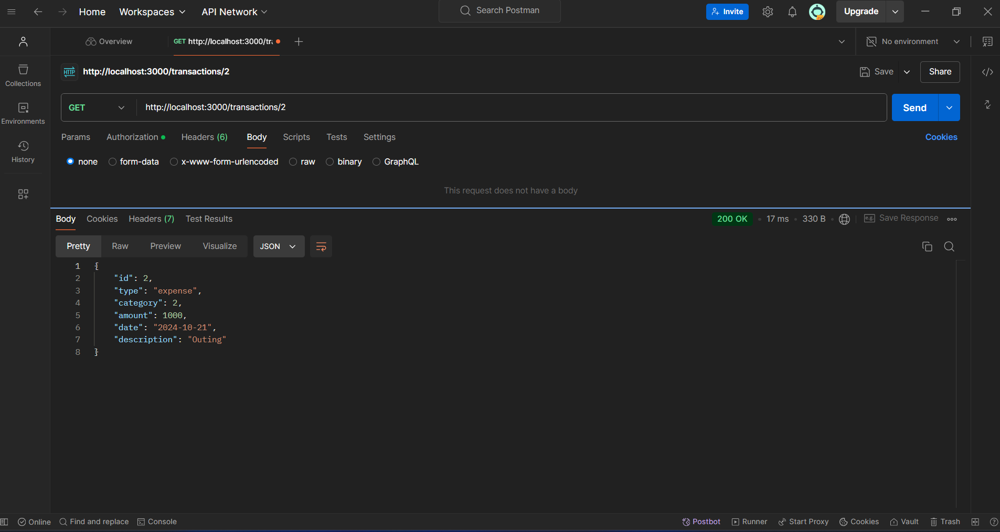
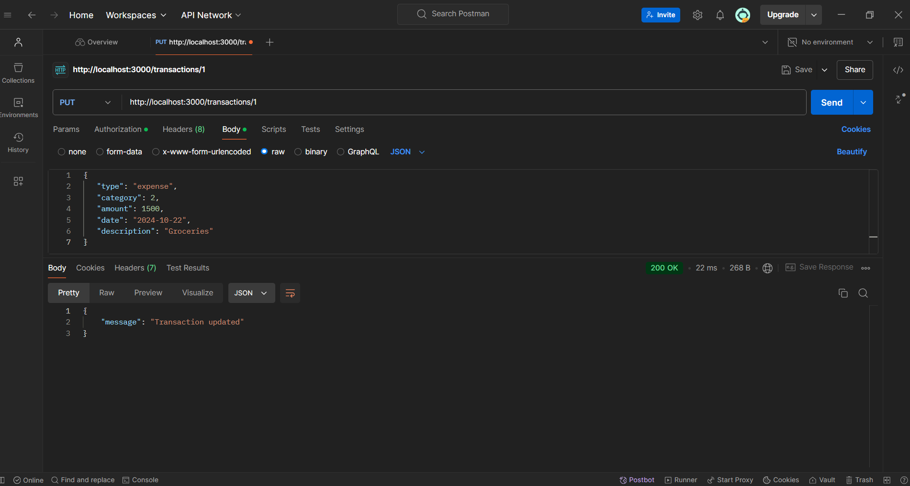
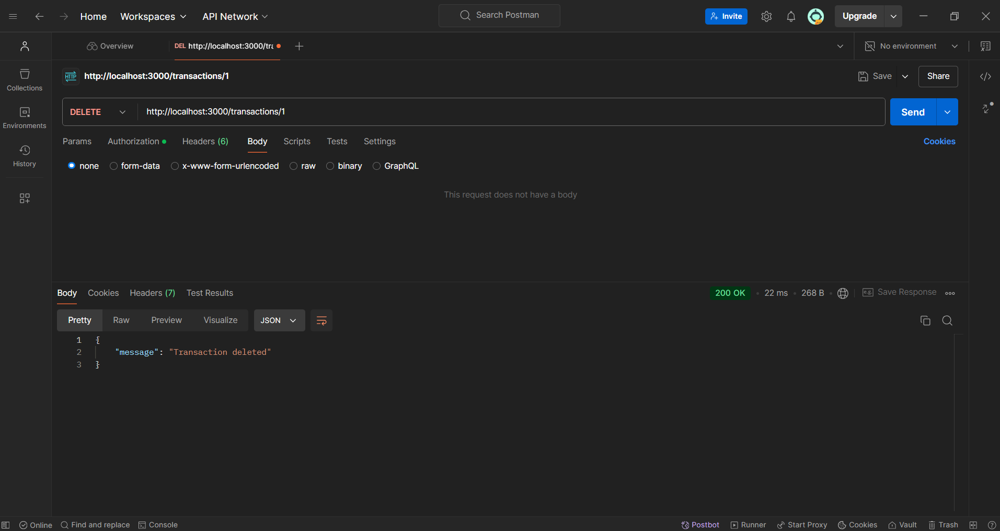

# Personal Finance Management API

This is a RESTful API for managing personal financial records. Users can record income and expenses, retrieve past transactions, and get summaries by category or time period. It includes user authentication with JWT to protect routes and associate transactions with specific users.

## Features
    - User authentication (register, login) using JWT.
    - Record income and expenses.
    - Retrieve past transactions, with pagination support.
    - Update and delete transactions.
    - Generate financial summaries (total income, total expenses, and balance).
    - Monthly spending reports by category.

## Technologies
    - **Backend Framework**: Node.js with Express.js
    - **Database**: SQLite
    - **Authentication**: JWT (JSON Web Tokens)

## Prerequisites
    - Node.js (v14 or higher)
    - npm (Node Package Manager)
    - SQLite3 

## Getting Started

### 1. clone the repository
`git clone  https://github.com/tridev002/finance-API.git`
### 2.  Install dependencies
`npm install`
### 3.Set up the database
You need to create the SQLite database and tables. Run the following command:
`sqlite3 finance.db < create_db.sql`
This will create  tables:
- `users`:Stores user credentials.
- `categories`: Stores predefined income/expense categories.
- `transactions`: Stores all income and expense records linked to users.

### 4. Start the Server
`node server.js`

The server will run on `http://localhost:3000`.

### 5. Example Postman Collection
You can import the provided Postman collection to test the API:

- [Postman Collection Link] (Add your actual link)

## Authentication Routes
### 1. Register User
- URL: /auth/register
- Method: POST
- Description: Register a new user.
- Request Body:
```
{
  "username": "john",
  "password": "password123"
}
```
Response:
```
{
  "message": "User registered"
}
```
### 2. Login User
- URL: /auth/login
- Method: POST
- Description: Login and generate a JWT token.
- Request Body:
```
{
  "username": "john",
  "password": "password123"
}
```
- Response:
```
{
  "token": "jwt_token_here"
}
```
### Transaction Routes (Requires Authentication)
Include the JWT token in the Authorization header as follows:

```Authorization: Bearer <token>```
### 1. Add a New Transaction
- URL: `/transactions`
- Method: `POST`
- Description: Add a new transaction (income or expense).


### 2. Get All Transactions
- URL: `/transactions`
- Method: `GET`
- Description: Get all transactions for the authenticated user.


### 3. Get a Single Transaction by ID
- URL: `/transactions/:id`
- Method: `GET`
- Description: Retrieve a transaction by its ID.


### 4. Update a Transaction by ID
- URL: `/transactions/:id`
- Method: `PUT`
- Description: Update a transaction by ID.


### 5. Delete a Transaction by ID
- URL: `/transactions/:id`
- Method: `DELETE`
- Description: Delete a transaction by its ID.
